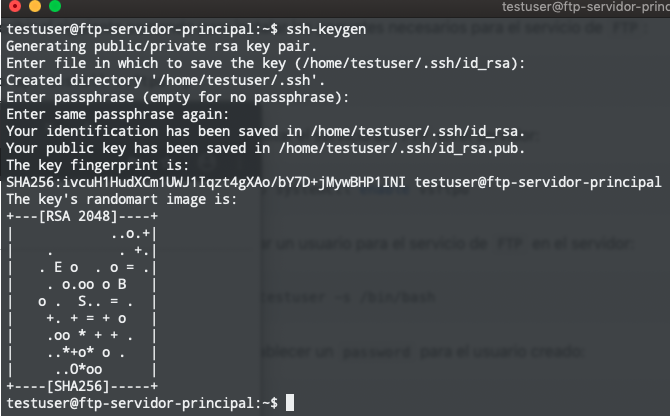

# Tabla de Contenidos

- [Pre-requisitos](#pre-requisitos)
    - [Multipass](#multipass)
        - [Instalando Multipass](#instalando-multipass)
    - [Instalando Git SCM](#instalando-git-scm)
    - [Instalando FileZilla](#instalando-filezilla)

# Pre-requisitos

<details>
  <summary>Click aqui para ver los pre-requistos</summary>
  
## Multipass


[Multipass](https://multipass.run) proporciona una interfaz de línea de comandos para iniciar, administrar y, en general, jugar con instancias 
de Linux. La descarga de una imagen fresca lleva unos segundos, y en cuestión de minutos una VM puede estar en 
funcionamiento.

[Multipass](https://multipass.run) es un software gratuito desarrollado por Ubuntu que permite instalar maquinas virtuales de manera similar
a que si las tuvieramos en un [container](https://www.docker.com).
Las ventajas de Multipass a comparacion de las clasicas maquinas virtuales es basicamente que no se necesita un gran
equipo para poder instancias de ubuntu.
Cuando se habla de una instancia se hace referencia a una imagen que contiene cierto sistema operativo.

### Instalando Multipass

El siguiente link lleva a la descarga de un ejecutable desde el sitio oficial:

- :link: [Link de descarga](https://github.com/canonical/multipass/releases/download/v1.2.1/multipass-1.2.1%2Bwin-win64.exe)

### Habilitando Hyper-V en Windows

Para poder correr cualquier maquina virtual en Windows tenemos que habilitar `Hyper-V`, que por default viene deshabilitado.

Para poder habilitarlo basta con abrir Windows Power Shell (como Administrador), escribir el siguiente comando y reiniciar:

```bash
Enable-WindowsOptionalFeature -Online -FeatureName Microsoft-Hyper-V -All
```

> Si no sabe como abrir Windows Power Shell en Windows vea el siguiente video [como abrir Windows Power Shell en Windows](https://www.youtube.com/watch?v=doUhN9YwZ6U)

## Instalando Git SCM


`Git SCM` es una herramienta gratuita de linea de comandos para Windows que nos permitira manejar `multipass` con comandos:

- :link: [Link de descarga](https://git-scm.com/downloads)

## Instalando FileZilla


[FileZilla](https://filezilla-project.org) es una herramienta gratuita que nos permite pasar archivos desde una maquina a otra
con mucha facilidad.

- :link: [Link de descaga](https://filezilla-project.org/download.php?platform=win64)

</details>

# Servidores

Con `Multipass` podemos crear dos servidores (con imagenes de Ubuntu), uno nos servira como servidor principal y otro
nos servira como espejo.
La funcion del servidor espejo es tener una copia fiel tanto del sistema operativo, como de los archivos que se encuentran
en el servidor principal, esto quiere decir que si el usuario sube un archivo al servidor principal el servidor espejo
automaticamente tendra el mismo archivo.

## Creando los servidores

<details>
  <summary>Click aqui para ver la seccion de creacion de servidores</summary>

A continuacion se detallan los pasos para crear los servidores:

1 - Abrir la consola de `Git CMD` y escribir los siguientes comandos:

```bash
multipass launch --name ftp-servidor-principal
multipass launch --name ftp-servidor-espejo
```

<details>
  <summary>Click aqui para ver un ejemplo de la salida de consola</summary>
  
  
  
</details>

> El nombre de los servidores es muy descriptivo por si mismo, notese que al principio del nombre se agrego la palabra
> `ftp` ya que ese es el proposito de estos servidores, servir con el protocolo `ftp` para hacer la funcion de espejo.


2 - Para revisar que los servidores existan y esten corriendo en el sistema escriba el siguiente comando:

````bash
multipass list
````

<details>
  <summary>Click aqui para ver un ejemplo de la salida de consola</summary>
  
  
  
</details>

</details>


## Configurando los servidores

A continuacion se configuran los servidores previamente creados para que funcionen con el protocolo de `FTP`.
El significado de las siglas **FTP** es: `File Transfer Protocol` que es un protocolo de transfencia de archivos, si te 
interesa conocer un poco mas sobre este protocolo [has click aqui](https://es.wikipedia.org/wiki/Protocolo_de_transferencia_de_archivos)


### Instalando paquetes en los servidores

<details>
  <summary>Click aqui para ver la seccion de instalacion de paquetes en los servidores</summary>

> **Los siguientes pasos se tendran que repetir en cada servidor**

1 - Entrar al servidor a traves de linea de comandos con `Git Bash`
1.1 - Abrir `Git Bash`
1.2 - Escribir el siguiente comando:

````bash
multipass shell <nombre-del-servidor>
````

> Sustituir `<nombre-del-servidor>` por cualquiera de los nombres de los servidores que tenemos instalado.

<details>
  <summary>Click aqui para ver un ejemplo del comando multipass shell "nombre-del-servidor"</summary>
    
  
    
</details>


2 - Escribir el siguiente comando para actualizar los paquetes del servidor:

````bash
sudo apt update -y && sudo apt upgrade -y
````

3 - Escribir el siguiente comando para instalar los paquetes necesarios para el servicio de `FTP`:

````bash
sudo apt install vsftpd -y
````

4 - Escribir el siguiente comando para habilitar el servicio de `FTP` en el servidor:

````bash
sudo systemctl start vsftpd && sudo systemctl enable vsftpd
````

5 - Escribir el siguiente comando para crear un usuario para el servicio de `FTP` en el servidor:

````bash
sudo useradd -d /home/testuser -m testuser -s /bin/bash
````

6 - Escribir el siguiente comando para establecer un `password` para el usuario creado:

````bash
sudo passwd testuser
````

> Nota: el comando anterior les pedira que escriban un password dos veces para poder verificar que los password coincidan


7 - Escribir el siguiente comando para configurar el firewall para aceptar el trafico del protocolo `FTP`:

````bash
sudo ufw allow 20/tcp && sudo ufw allow 21/tcp
````

<details>
  <summary>Click aqui para ver un ejemplo de la salida del comando anterior</summary>
  
  
  
</details>

</details>


### Habilitar la transferencia de archivos mediante FileZilla

<details>
  <summary>Click aqui para ver la seccion de habilitar la transferencia de archivos mediante FileZilla</summary>
  
> **Los siguientes pasos solo se realizaran en el servidor principal (ftp-servidor-principal)r**

1 - Entrar al servidor a traves de linea de comandos con `Git Bash`
1.1 - Abrir `Git Bash`
1.2 - Escribir el siguiente comando:

````bash
multipass shell ftp-servidor-principal
````

2 - Escribe el siguiente comando para habilitar la escritura de archivos en el archivo `/etc/vsftpd.conf`:

````bash
sudo sed -i 's|#write_enable=YES|write_enable=YES|g' /etc/vsftpd.conf
````

3 - Escribe el siguiente comando para reiniciar el servicio de `FTP`:

````bash
sudo systemctl restart vsftpd.service
````  
  
</details>


### Habilitando la transferencia de archivos mediante SSH a los servidores

<details>
  <summary>Click aqui para ver la seccion de transferencia de archivos mediante SSH a los servidores</summary>
  
Habilitar la transferencia de archivos mediante el protocolo de `SSH` nos permitira el poder sincronizar los archivos 
subidos al servidor principal con el servidor espejo.

> **Los siguientes pasos solo se realizaran en el servidor principal (ftp-servidor-principal)**

1 - Entrar al servidor a traves de linea de comandos con `Git Bash`
1.1 - Abrir `Git Bash`
1.2 - Escribir el siguiente comando:

````bash
multipass shell ftp-servidor-principal
````

<details>
  <summary>Click aqui para ver un ejemplo del comando multipass shell "nombre-del-servidor"</summary>
    
  
    
</details>

2 - Escribir el siguiente comando para modificar el archivo `/etc/ssh/sshd_config` relacionado con el protocolo de `SSH`:

````bash
sudo sed -i 's|#PermitRootLogin prohibit-password|PermitRootLogin yes|g' /etc/ssh/sshd_config
sudo sed -i 's|PasswordAuthentication no|PasswordAuthentication yes|g' /etc/ssh/sshd_config
````

3- Reiniciar el servicio de `SSH` para que surtan efectos los cambios realizados:

````bash
sudo service ssh restart
````
  
</details>


### Habilitar la conexion de manera segura del servidor principal hacia el servidor espejo

<details>
  <summary>Click aqui para ver la seccion de conexion segura al servidor principal hacia el servidor espejo</summary>
  
El habilitar la conexion del servidor principal hacia el servidor espejo le permitira al servidor principal poder sincronizar
los cambios en los archivos para que sean actualizados de manera rapida y segura en el servidor espejo.

1 - Entrar al servidor a traves de linea de comandos con `Git Bash`
1.1 - Abrir `Git Bash`
1.2 - Escribir el siguiente comando:

````bash
multipass shell ftp-servidor-principal
````

2 - Escribir el siguiente comando para cambiarnos al usuario `testuser`:

```bash
su testuser
```

> Nota: el comando de arriva te pedira que introduzcas la contraseña para el usuario `testuser` la cual es **123**

2.1 - Escribir el siguiente comando para cambiarnos al directorio del usuario `testuser:`

````bash
cd
````

2.2 - Escribir el siguiente comando para generar una llave `SSH`:

````bash
ssh-keygen
```` 

> Nota: despues de darle **Enter** al comando anterior, debemos de darle enter a todo lo demas, vease en el ejemplo de abajo

<details>
  <summary>Click aqui para ver un ejemplo de la salida del comando anterior</summary>
  
  

</details>


3 - Escribir el siguiente comando para obtener la llave `SSH` generada:

````bash
cat "${HOME}/.ssh/id_rsa.pub"
````

> Has click en el siguiente ejemplo, ya que es la salida del comando anterior para que te des una idea de lo que tendras que
> copiar y guardar para el siguiente paso (todo lo que esta en verde lo tendras que copiar).
> Por motivos de seguridad la llave `SSH` generada en el ejemplo no se muestra completa.

<details>
  <summary>Click aqui para ver un ejemplo de la llave SSH </summary>
  
  

</details>


una vez copiada la llave `SSH` escribe el siguiente comando para salir del servidor principal:

````bash
exit
````

4 - Escribe el siguiente comando para entrar al servidor espejo:

````bash
multipass shell ftp-servidor-principal
````

5 - Repite del paso 2 al paso 2.2

6 - Escribe el siguiente comando para agregar la llave `SSH` del servidor principal al servidor espejo

```bash
echo "<la_llave_ssh_del_paso_3>" > "${HOME}/.ssh/authorized_keys"
```

> Nota: las comillas en el comando anterior son importantes, no olvides ponerlas
  
  
</details>


 


## Probando la conexion FTP de los servidores

<details>
  <summary>Click aqui para ver la seccion de la conexion FTP de los servidores</summary>
  
> **Para probar que la conexion `FTP` este habilitada en cada servidor deberan repetir los siguientes pasos en cada servidor.**

1 - Entrar al servidor a traves de linea de comandos con `Git Bash`
1.1 - Abrir `Git Bash`
1.2 - Escribir el siguiente comando para obtener la direccion `IP` del servidor:

````bash
multipass ls
````

<details>
  <summary>Click aqui para ver un ejemplo del comando anterior obteniendo la ip del servidor</summary>
    
  
    
</details>


2 - Abrir una pestaña de tu navegador (ejemplo: `Google Chrome`) y escribir lo siguiente:

````text
ftp://<direccion_ip_servidor>
````

<details>
  <summary>Click aqui para ver un ejemplo del comando anterior</summary>
    
  
    
</details>

2.1 Escribir el usuario y contraseña previamente establecidos en el servidor los cuales son:

- usuario: `testuser`
- contraseña: `123`

A este punto seras capaz de visualizar una pagina web con un titulo "Index of", es esta pagina se mostraran los archivos
que subas al servidor.


<details>
  <summary>Click aqui para ver un ejemplo</summary>
    
  
    
</details>

</details>

